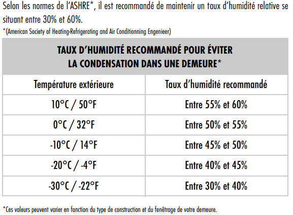

+++
title = "Ce qu’il faut savoir"
weight = 4
+++
Pour le confort quotidien, le taux d’humidité ambiante recommandé varie de 40% à 60%. 50% étant une bonne moyenne.

Durant l’été, l’humidité de l’air extérieur est souvent élevée, la réduction du taux d’humidité via l’échangeur d’air est moins efficace. L'échangeur d'air restera malgré tout le meilleur moyen de se débarrasser de la surcharge d'humidité créée par un bain ou une douche.
Durant l’été la consigne d’humidité ciblée sera alors réglée entre 50% et 60%.

Durant l’hiver c’est l’inverse, l’air extérieur étant très sec, la diminution de l’humidité ambiante par échange d’air devient très efficace. Il est important d'avoir un échangeur d'air opérationnel afin d'éviter l'apparition de forte condensation d’eau sur les fenêtres pouvant entraîner des dégâts.
Durant l’hiver la consigne d’humidité ciblée sera alors réglée plus proche des 40%.

Le taux d’humidité recherché est à ajuster en fonction de votre confort, mais d’une manière générale, dû aux conditions météorologiques, il sera toujours plus humide durant l’été ou un jour de pluie et plus sec durant l’hiver.

Voici la table de référence indiquée dans le manuel utilisateur.

