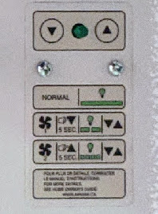
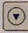
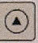

+++
title = "Réglage de la vitesses des ventilateurs"
weight = 6
+++
Lorsque la VRC est activée pour échanger l’air et diminuer le taux d'humidité, les ventilateurs fonctionnent alors en vitesse “haute”.
Désactivé / au repos, les ventilateurs tournent en vitesse “basse” (à exception de l'état d'inactivité complète obtenable avec le contrôleur électronique).

Une vitesse "haute" plus élevée permet d’avoir une période d’activation, pour réduire le taux d’humidité, plus efficace, plus courte, mais va générer plus de bruit. A partir d’un certain point cela pourrait vous déranger. Si besoin diminuez cette vitesse mais ne débranchez pas complètement l’appareil.

La vitesse "basse" est celle lorsque l'appareil est au repos (recirculation d’air entre les pièces dans le mode par défaut). Faites en fonction de vos préférences et sachez que vous pouvez la réduire au minimum, cela n’aura pas d’impact sur la capacité de l’appareil à éliminer l’air vicié.

### Pour ajuster l’intensité de la vitesse "basse" :

+ Enfoncez le bouton  pendant cinq secondes.

+ Lorsque la lumière clignote lentement, ceci indique que les ventilateurs fonctionnent actuellement à basse vitesse et que vous pouvez passer à l’ajustement:  
*ajustez la basse vitesse en utilisant les deux boutons et afin d’augmenter ou de réduire l’intensité à votre convenance* 

+ Pour mettre fin à l’ajustement, enfoncez un des deux boutons pendant trois secondes ou cessez de toucher aux boutons pendant plus de cinq minutes.

### Pour ajuster l’intensité de la vitesse "haute":
- Enfoncez le bouton  pendant cinq secondes.

- Lorsque la lumière clignote rapidement, ceci indique que les ventilateurs fonctionnent actuellement à haute vitesse et que vous pouvez passer à l’ajustement:  
*ajustez la haute vitesse en utilisant les deux boutons et afin d’augmenter ou réduire l'intensité à votre convenance*

- Pour mettre fin à l’ajustement, enfoncez un des deux boutons pendant trois secondes ou cessez de toucher aux boutons pendant plus de cinq minutes.

***Si la lumière cesse de clignoter, lors de l’ajustement des vitesses, ceci vous indique que vous avez atteint soit la limite inférieure, soit la limite supérieure.***

### Retour aux réglages d’usine, valeurs par défauts:

Débrancher la prise murale d’alimentation de l’appareil.

+ Maintenez les boutons  et  enfoncés tout en rebranchant la prise d’alimentation.

+ À ce moment la lampe témoin clignote rapidement 3X pour indiquer la réussite de l’opération.
