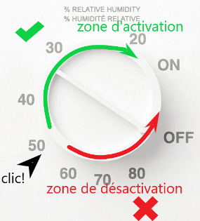

+++
title = "Comment utiliser la VRC"
weight = 5
+++
Le boîtier de contrôle du taux d’humidité

Il permet de régler la consigne d’humidité que l’utilisateur souhaite obtenir dans son unité, par exemple 50%. Si on veut un environnement plus sec, on tourne le bouton dans le sens des aiguilles d’une montre, sur 40% par exemple.

Lorsqu’on tourne le bouton de droite à gauche il y a une position qui fait entendre une sorte de clic sonore. La position de ce clic donne une indication du niveau approximatif du taux d’humidité détecté à l’intérieur de l’unité.

 - La photo d'exemple ci-dessus montre qu’on entend le clic un peu au-dessus de 50%. On peut en conclure que le taux d’humidité au sein de l’unité est d’environ 50% ce qui est très bien.
 
 - Si on tourne le bouton dans le sens des aiguilles d’une montre (zone verte), cela va activer l’échange d’air à vitesse maximale. Si on plaçait le bouton à 40% la machine tournerait alors jusqu’à ce que le taux d’humidité réduise à la consigne de 40% demandée. Le clic se ferait alors entendre de plus en plus bas jusqu'à environ 40% et la mise au repos de la machine. 
Si on continuait de tourner le bouton complètement dans ce sens, on atteindrait la position ON qui activera obligatoirement l’échange d’air à vitesse maximale et ne s’arrêtera jamais à moins que le bouton soit retourné dans le sens opposé passé le clic.
 
 - Au contraire du cas précédent, si on tournait le bouton dans le sens contraire des aiguilles d’une montre, la zone rouge, cela augmenterait la consigne d'humidité désirée. La machine ne se mettra donc pas en marche puisque le taux d’humidité est déjà plus bas que la nouvelle consigne. La VRC démarrera et tournera moins souvent.
Si le on continuait de tourner le bouton complètement jusqu’à la position OFF, zone de désactivation, le VRC ne se serait plus jamais activée en mode échange à haute vitesse et resterait indéfiniment dans son mode repos *(voir principe de fonctionnement)*.
