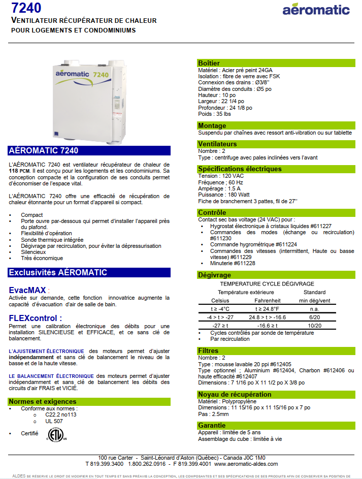

+++
title = "Annexes"
weight = 9
+++
### Fiche technique

___

### Fournisseurs
La compagnie Aéromatic n’existe plus et est remplacée par Aldes.

Cette page donne l’information des filtres compatibles : #612404, #612405, #612406, #612407 que l’on peut trouver sur le site de Aldes: [https://www.aldes.ca/residential-ventilation-product/filters/](https://www.aldes.ca/residential-ventilation-product/filters/)

La liste des distributeurs pour Aldes sera aussi sur leur site.

Le boîtier de contrôle qui est installé dans nos unités :  
**Manufacturer**: Broan  

**Part Number**: DH100W  

**Product Dimensions**: 9.53 x 6.99 x 11.3 cm; 226.8 Grams  

**Item model number**: 686307  

[https://www.amazon.ca/gp/product/B00155VU5S]([https://www.amazon.ca/gp/product/B00155VU5S])
___

### Manuel original
[Manuel Aeromatic/Aldes](ressources/manuel_aeromatic.pdf)
___

### Ressources diverses
[Ressources](https://github.com/d4d0o/latannerie/tree/main/docs/ressources)
___

