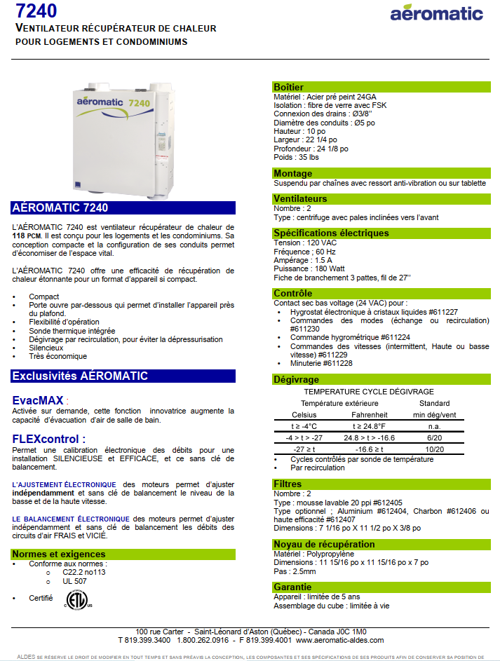

+++
title = "Annexes"
weight = 9
+++
{}
___
### Original manual
[Aeromatic/Aldes Manual](index.en.files/manuel_aeromatic.pdf)
___
### Suppliers
Aéromatic company doesn't exist anymore, Aldes took in charge.

Filters #612404, #612405, #612406, #612407 and accessories on Aldes web page: [https://www.aldes-na.com/ca_en/residential-product-category/roof-caps-wall-hoods-grilles-ca_en/](https://www.aldes-na.com/ca_en/residential-product-category/roof-caps-wall-hoods-grilles-ca_en/)i

Distributors for Aldes are on that site as well.

For example filters #612405 indicated as washable and compatible with our HRV (⚠️ not yet tested) can be found online here: [https://aspirabec.com/echangeurs-d-air/pieces-d-echangeur-d-air/aldes/filtre-612405-pour-echangeur-dair-aldes](https://aspirabec.com/echangeurs-d-air/pieces-d-echangeur-d-air/aldes/filtre-612405-pour-echangeur-dair-aldes)

Humidity control command module installed in our units is:  
**Manufacturer**: Broan  

**Part Number**: DH100W  

**Product Dimensions**: 9.53 x 6.99 x 11.3 cm; 226.8 Grams  

**Item model number**: 686307  

Has been found on Amazon [https://www.amazon.ca/gp/product/B00155VU5S]([https://www.amazon.ca/gp/product/B00155VU5S])
___
### Fiche technique

___

