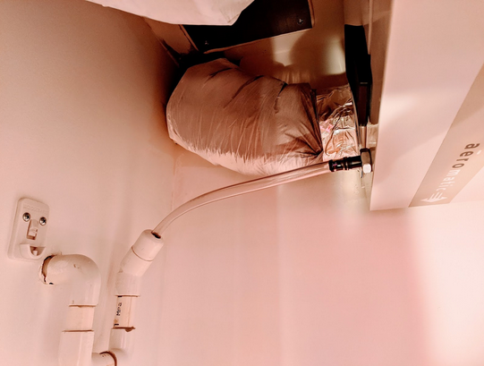

+++
title = "Problème de condensation / forte humidité ambiante"
weight = 8
+++
### Vérification de bon fonctionnement de la VRC

La seule méthode pour assurer que l’ensemble des composantes nécessaires à la bonne évacuation de l’air est d’ouvrir le boîtier et d’activer la VRC.

***⚠ Il est donc important pour votre sécurité de faire cette opération au calme, sans perturbation extérieure et dans un environnement complètement dégagé. Et ce uniquement si vous comprenez bien les étapes au préalable et avez les compétences pour le faire.***

***⚠ Si ce n’était pas le cas, n’hésitez pas à faire appel à une personne d’expérience, ou du métier, et profitez de sa présence pour montrer les points suivants et les vérifier ensemble.***

Le moment idéal pour faire cette vérification est lors d’une opération de nettoyage du noyau :
+ Commencez par débrancher l’alimentation de la prise murale
+ Ouvrez le caisson de la VRC, enlevez le noyau et procédez aux opérations de nettoyage suivant le manuel et les informations complémentaires de ce guide
+ Avant de remonter le noyau dans la VRC, pendant que votre environnement est encore dégagé et que la VRC est encore ouverte continuez à l’étape suivante :
	+ Tournez complètement le bouton du boitier dans le sens des aiguilles d'une montre (consigne à 0%, ON, activation forcée permanente)  

+ ***⚠ C’est à partir de ce moment qu’il faut faire attention à ne pas mettre ses doigts dans les ventilateurs. Assurez-vous que personne d’autre n’est présent et ne risque de toucher l’intérieur de la VRC. Assurez-vous aussi que vous ne serez pas dérangé ni déstabilisé.***:

	+ Rebranchez l’alimentation électrique murale
	
	+ Avec 1 seul doigt uniquement, faites pression sur le bouton poussoir de sécurité et maintenez le 15 à 30 secondes pendant que la VRC s’allume et s’active
	
	+ Vous devez observez la mise en rotation des 2 ventilateurs ainsi que l’ouverture de la trappe d’accès à l’aire extérieur, conformément à la photo suivante

+ Relâchez le bouton puis débranchez l’alimentation de la prise murale avant de terminer les opérations de nettoyage et de remontage du noyau.

#### En cas de défaut les causes possibles, et à vérifier dans l’ordre sont :
1. Mauvais câblage - fort probable - référez-vous au manuel d’installation si vous avez les compétences ou faites appel à quelqu’un d’expérience.
2. Mauvais contact dans le boîtier de contrôle - probable - à moins d’avoir les compétences pour le vérifier vous devrez faire appel à quelqu’un.
3. Défaut de la VRC - peu probable - vous devrez vous rapprocher d’un fournisseur pour la faire réparer ou vous équiper d’une nouvelle VRC.

### Porte salle de bain
L’aspiration de l’air vicié, chargé d’humidité, pour l’évacuation vers l’extérieur se fait par la salle de bain. A l'exception des moments où cela est strictement nécessaire, la porte de salle de bain **doit rester en permanence ouverte**.

Si vous aviez l’habitude de garder la porte fermée en tout temps, l’ouvrir est la toute première des choses à faire !

### Déplacement du boîtier de contrôle
Il a été observé dans des unités que le boîtier de contrôle du taux d’humidité était installé dans une zone particulièrement sèche de toute l’unité (entrée par example). Suivant les fluctuations d'air au sein du bâtiment et de l'unité, l’humidité de la salle de bain a la possibilité de se répartir dans les pièces et de condenser sur les fenêtres sans que le boîtier de contrôle ne détecte une augmentation significative. L’échangeur ne se déclenche alors pas du tout ou pas assez. L'humidité reste prisonnière de l'unité malgré un échangeur d'air nettoyé et en état de fonctionnement.

La solution est de déplacer le boîtier de contrôle dans une zone plus adéquat.

Dans le cas de nos unités, les câbles électriques sont tels qu'il est possible d'inverser la position du boîtier avec celui de la minuterie se trouvant dans la salle de bain. Le boîtier de contrôle, se trouvant maintenant dans la pièce la plus humide, va immédiatement capter l'augmentation du taux ambiant et activer automatiquement la VRC la VRC parfaitement efficace.

*La minuterie ira alors prendre la place libre, l’entrée par exemple, sera maintenant l'endroit d'où vous pourrez temporairement activer votre VRC en cas de besoin ponctuel déćhange d'air.* 

##### *Extrait du manuel d’installation*

### Utilisation de la minuterie / réduction de la consigne
**Déclencher la minuterie sur 40 ou 60 minutes :**
+ À chaque douche ou bain
+ Lorsque vous cuisinez
+ Faites votre lavage

Vous pouvez aussi diminuer la consigne d’humidité sur le boîtier vers 30% ou peut-être même 20% durant la saison hivernale ou la condensation est la plus intense. 
Attention par contre, pensez à être présent pour observer le comportement. Si vous descendez la consigne trop bas vous risquez de mettre la VRC en activation forcée en permanence, cela finirait par gaspiller de l’énergie, engendrer des pertes de chaleur et générer du bruit dommageable pour votre confort.

*Durant les périodes les plus froides il peut arriver que la VRC commence à geler à l'intérieur. Elle se protège automatiquement en faisant tourner à pleine vitesse ses ventilateurs en faisant circuler l'air à l'intérieur de l'unité pour réchauffer sa mécanique. Cela engendre un bruit de VRC en constante activation*
 
### Mauvais drainage
Le tuyau de drainage ne doit pas faire une boucle vers le haut. Si ce n’était pas le cas, ajustez-le comme sur la photo suivante (raccourcissez le si nécessaire).
Si vous voulez le changer les diamètres du tube sont :
Intérieur ⅜” ID  
Extérieur ½” OD

*Éventuellement il est possible d’ajuster les fixations pour augmenter légèrement l’inclinaison de la machine afin de faciliter l’écoulement de la condensation vers la sortie du drain.*
