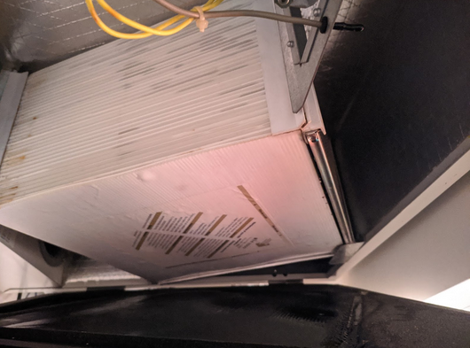
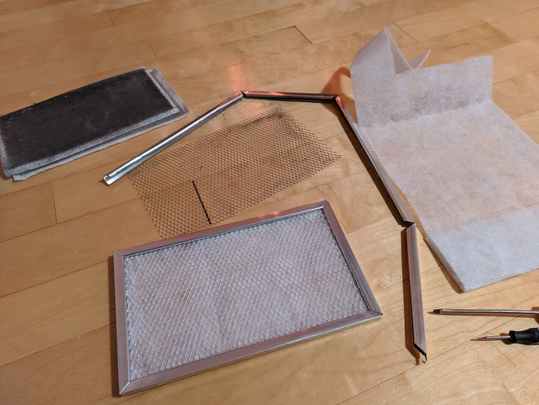

+++
title = "Entretien de la VRC"
weight = 7
+++
### Ce que le mode d’emploi indique
*ATTENTION : TOUJOURS DÉBRANCHER LA FICHE ÉLECTRIQUE AVANT DE FAIRE L’ENTRETIEN*

*"À chaque mois, vérifiez que l’entrée et la sortie d’air ne soient pas obstruées par des particules ou de la glace.*

*Durant l’hiver, vérifiez mensuellement que les ouvertures des drains de condensation ne soient pas obstruées.*

*Trois fois par an ou au besoin, nettoyez les filtres avec de l’eau savonneuse, à la main ou au lave-vaisselle.*

*Une fois par année ou au besoin, nettoyez le noyau récupérateur de chaleur. Retirez-le délicatement de l’appareil et tirant vers vous. Il est conseillé de porter des gants lors de la manipulation afin d’éviter des coupures.*

*Une fois par année, de préférence à l’automne, passer l’aspirateur à l’intérieur de l’appareil."*
___

### Complément utile d’information
#### Ouverture
+ Les entrées et sorties d’air étant situées sur la façade du bâtiment ou éventuellement sous le balcon de l’étage supérieur, les chances qu’elles soient obstruées dans notre cas sont minimes. Regardez les à l’occasion mais vous n’avez pas besoin de vous inquiéter plus que cela. La majeure partie sont de toute façon inaccessible vu leur positionnenent en hauteur sur la façade.

+ Il est probable que les filtres apposés sur le noyau ne soient pas lavables comme ceux d’une hotte de cuisine par exemple, mais composés d’une mousse jetable. Faites appel à votre bon sens.

+ Dans le cas de filtres jetables, changez-les. Éventuellement achetez des filtres lavables. Des références sont données dans les fiches techniques en annexe à la fin du document. Aeromatic a été racheté par Aldes depuis, c'est eux qu'il faut contacter pour obtenir de plus amples insformations.

+ Lors de l’ouverture de la VRC, plus fréquemment en période hivernale, vous pourriez être surpris par un volume d’eau condensée à l’intérieur de l’appareil assez conséquent. Prévoyez de quoi récupérer l’eau qui va tomber et d’essuyer les éclaboussures.
+ Pensez à libérer la zone pour éviter de mouiller, ou d’endommager, vos biens.
+ ⚠ Débranchez absolument la prise électrique murale avant d'ouvrir, vous pourriez avoir les mains et les pieds mouillés !

##### *En ouvrant la trappe, l’apparition d’eau dans le drain est un bon signe que vous risquez d’avoir de l’eau qui va couler par terre. Refermez et allez vous équiper avec de quoi éviter les dégâts.*

##### *En plein hiver, période avec la plus grosse condensation, on voit ici des signes que le noyau est plein d’eau. A l'extraction du noyau une bonne quantité d'eau va couler. Vous allez avoir besoin d'un récipient.*

##### *Exemple de la quantité d’eau rencontré durant la période la plus froide et donc créant le plus de condensation.*
___

#### Noyau
+ Les meilleures consignes possibles pour nettoyer le noyau récupérateur de chaleur sont inscrites dessus :

  

+ Après avoir trempé le noyau dans l’eau, celui-ci va mettre beaucoup de temps à sécher. Il est donc recommandé de faire ce nettoyage durant une période sèche avec peu d'humidité ambiante.
+ ⚠ Ne surtout pas exposer le noyau en plein soleil durant l’été, il va fondre, se déformer et l'échangeur d'air ne pourra plus fonctionner normalement.
___

#### Filtres

##### *Ces filtres ont 2 ans, ils étaient blancs à l’origine !*

##### *Leur référence est #612407, sont identifiés comme étant de haute efficacité, mais sont très onéreux et ne sont pas lavables.*

##### *Il est possible de les refaire à partir d’un filtre générique, moins efficace mais moins onéreux. Il faudra les changer plus souvent.*

##### *L’option des filtres lavables semble donc une bonne idée.*

#### Nettoyage des conduites d’air
Il est tout aussi important de faire nettoyer les conduites.

Cette opération doit être planifiée car elle nécessite des outils adaptés pour aspirer l’intérieur des conduites qui traversent toute l’unité afin d'éliminer les impuretés.

Des professionnels sont spécialisés dans ces opérations.
