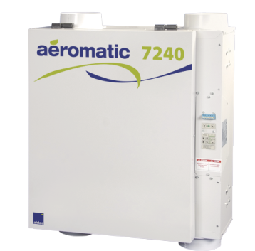

+++
title = "Ventilateur Récupérateur de Chaleur"
weight = 1
+++
Les unités de la Tannerie sont toutes équipées d'un échangeur d'air à récupération de chaleur.

La présence de forte condensation sur les fenêtres durant tout l'hiver, ou bien par exemple un fonctionnement bruyant permanent perturbant votre quiétude sont des signes que ces appareils ne sont pas en bon état de fonctionnement ou non utilisé correctement.

Ce document vise à rassembler des informations pour aider à la compréhension et la bonne utilisation de ces appareils, votre quiétude, votre santé et l'intégrité de votre habitation.

*mise à jour de la documentation: 2023/09/10*
