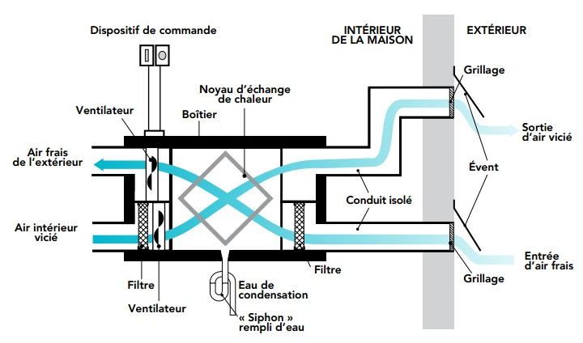

+++
title = "Principe de fonctionnement"
weight = 3
+++
Le principe de fonctionnement consiste à échanger de l’air vicié humide de l’intérieur de l’unité avec de l’air frais plus sec provenant de l’extérieur.
De plus, il utilise la chaleur de l’air intérieur pour réchauffer l’air froid venant de l’extérieur afin de limiter la perte d’énergie. D’où son appellation commune d’échangeur d’air à récupération de chaleur.

###### *Représentation de principe - ce n’est pas une exacte reproduction des unités de la Tannerie, seule la salle de bains a une conduite d'aspiration*

Cela permet donc de diminuer le taux d’humidité ambiante, la condensation sur les fenêtres par exemple, ainsi que cela contribue à la réduction des odeurs.

L’appareil a 2 états de fonctionnement, il est soit dans l’état actif, soit dans l’état repos :

**Actif / activé (haute vitesse) ou échange**
C’est le mode d’échange d’air avec l’extérieur (haute vitesse)
Activé lorsque que l’utilisateur le demande avec la minuterie ou lorsque que l’humidité ambiante passe au dessus de de la valeur de consigne réglée sur le boîtier

**Repos**
L’état repos ou “inactif” est le mode fonctionnement dans lequel se met l’échangeur d’air lorsqu'il n’est plus commandé soit par la minuterie, soit par une humidité ambiante déjà inférieur à la consigne réglée sur le boîtier.
Il est possible de choisir parmi 3 modes différents possibles au repos en fonction du branchement qui a été fait :

1. Recirculation de l’air, basse vitesse, à l’intérieur de l’unité, aucun échange avec l’extérieur *(mode par défaut)*

2. Echange d’air, basse vitesse, avec l’extérieur *(mode équivalent à l’état actif mais à plus basse vitesse)*

3. Totalement inactif *(mode uniquement disponible avec un boitier de commande électronique Aldes dédié)*

> **Notez que cet appareil est un échangeur d’air et non un déshumidificateur** :
> 
> • Durant une journée de pluie ou d’été chaude, l’air extérieur devenant plus humide, l’appareil ne pourra jamais réduire l’humidité de l’unité en échangeant avec l’air extérieur, puisqu’il ne fera que recycler avec un air plus humide. Une consigne d'humidité réglée trop basse entrainera alors l’appareil à être activé inutilement en permanence.
> 
> • Même si l’humidité dans ces conditions ne peut être réduite cela permet tout de même d’assainir l’air ambiant, de réduire les mauvaises odeurs, avec de l'air extérieur. La minuterie est particulièrement pratique dans ces conditions.
